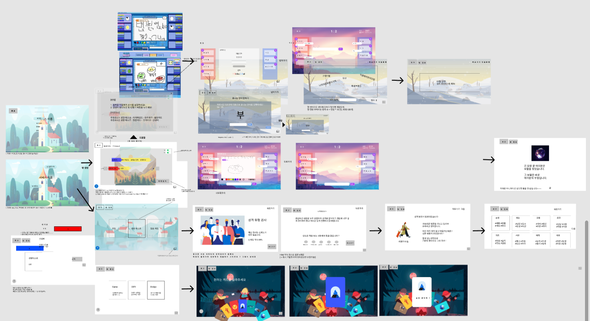
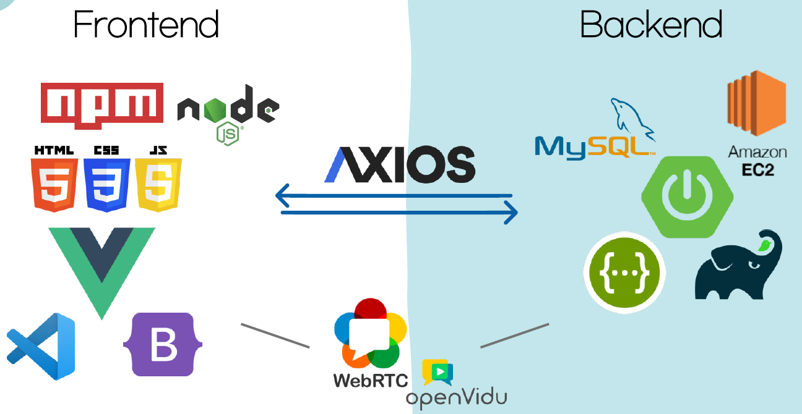

# README

> 온라인 친목 플랫폼 **짜사이(ZZASAI)**

---

[TOC]

---


## 📑 프로젝트 소개

- 진행기간 : 2021.04.12 ~ 2021.05.22
- 목표
  1. 온라인에서 친목 도모를 할 수 있는 심플하고 전략적인 오락 서비스를 제공한다.
  2. 사용자 중심 UI/UX 개발로 편리하면서도 흥미로운 디자인을 제공한다.
  3. 기존 서비스와 차별화를 강조하여 사용자의 만족도를 높이고 서로 소통할 수 있는 요소를 더하여 사용자 간 커뮤니케이션과 정보 공유를 활성화한다.


## 👀와이어프레임




## 🕹️주요 기능

- **화상채팅**
  - 실시간 화상채팅을 통해서 화상 및 음성으로 참여자 간에 원활하게 소통할 수 있다.
- **이어그리기**
  - 쉽게 참여 가능한 게임을 통해 흥미와 소통 두 가지를 모두 이끌어 낼 수 있다.
- **성격유형검사**
  - 간단한 성격유형검사를 통해 참여자 간 서로에 대한 기본적인 이해를 구축할 수 있다.
- **질문카드**
  - 질문카드를 활용하여 이야기를 이끌어내며 사용자의 관계를 효과적으로 형성할 수 있다.


## ⚙️ 개발환경 & 기술스택




## 📌 기술 특장점

------

### 📃 Swagger Hub를 이용한 API 명세서 작성

Swagger Hub를 이용해 API 명세서를 작성함으로써 FE/BE 협업을 쉽게 할 수 있도록 했습니다. 실제 사용되는 Parameter로 테스트할 수 있고, 어떤 방식으로 데이터를 주고받을지 확인할 수 있어서 개발 시간을 단축하고 불필요한 의사소통 비용을 줄일 수 있었습니다

------

### 🌈 JIRA를 통한 Task 관리

JIRA를 통해 에픽, 스토리, 테스크등을 생성하여 스프린트를 계획하고 팀 전체가 볼 수 있도록 배포하였습니다. 이를 바탕으로 전반적인 팀 업무의 우선순위를 정하고 이에 대해 논의하며 업무를 수행하였습니다. JIRA와 Git lab 그리고 MatterMost를 서로 연동하여 실시간으로 팀원들이 수행한 업무를 확인할 수 있어서 시너지 효과를 발휘할 수 있었습니다.

------

### 📕 Vuex를 사용한 데이터 관리

Vuex는 Vue.js 애플리케이션에 대한 상태 관리 패턴 + 라이브러리로써, 컴포넌트 간 지속적으로 사용해야하고, 변경이 용이할 수 있는 데이터를 보관 및 비동기적으로 작업을 처리하기 위해 채택하였습니다.

------

### 📄Notion을 통한 회의록 관리

노트, 일정, 업무, 데이터, 프로젝트 등을 효율적으로 생성하고 관리할 수 있는 All-in-one 생산성 도구이자 협업 툴입니다. 그래서 프로젝트에 대한 의견 및 회의록을 공동 작업하기 위해 채택하였습니다. 매주 새로운 워크스페이스를 만들고, 워크스페이스 내에서 일일 스크럼, 앞으로의 일정, 기타 배운점 및 서로의 아이디어를 공유하여 팀원 간 의견을 편히 나눌 수 있었습니다.


## © Copyright

```markdown
- vuedraggable
```


**Copyright © 2021 SSAFY_SEOUL2_TEAM5_ZZASAI**