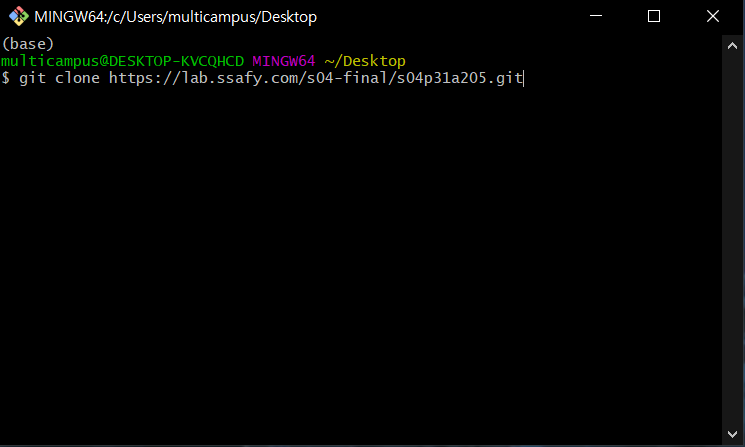

# 포팅 매뉴얼

> SSAFY 4기 자율프로젝트 서울 2반 5팀 **짜사이(ZZASAI)**

---


[TOC]

---


## 1. 프로젝트 세팅 방법

- 먼저 git repository를 clone해서 받아온다.

  

### frontend

- `frontend` 폴더로 이동해서 아래의 명령어로 node package를 설치한다.

  ```bash
  npm i
  ```

- 기존 프로젝트에서는 서버 url이 배포된 서버 주소가 입력되어 있기 때문에, frontend의 **서버 axios 요청 url을 사용하는 서버 url로 변경**하여 준다.

  - 예시
  
    ``` javascript
    // 기존 코드
  axios.GET(`https://k4a205.p.ssafy.io:8080/api/room/codecheck/?roomcode=${this.roomcode}`)
    // 변경 예시
axios.GET(`https://localhost:8080/api/room/codecheck/?roomcode=${this.roomcode}`)
    ```

  - :ballot_box_with_check: `frontend` 폴더에서 **.env**라는 환경변수 파일을 생성하여 **VUE_APP_SERVER_URL** 변수를 생성하고 서버 url을 관리하면 편리하다.
  
  ```
  // 입력예시
  VUE_APP_SERVER_URL=http://localhost:8080/api
  ```
  
  - :ballot_box_with_check: 서버 url 뒤에 반드시 **/api**를 붙여준다.
  
  - :ballot_box_with_check: 프론트 프로젝트에서 환경변수는 아래와 같이 가져올 수 있다.
  
    ```javascript
    const SERVER_URL = process.env.VUE_APP_SERVER_URL
    ```

### socket.io

- 웹 소켓을 사용하기 위해 `nodemon`이라는 노드 패키지를 설치해준다.

  ```bash
  npm i nodemon
  ```

  

## 2. 데이터베이스 덤프 파일

> 본 프로젝트는 별도의 데이터베이스 덤프 파일 설정이 필요 없다.

- `이어그리기`를 제시어로 진행할 경우, 데이터베이스의 `drawquestion` 데이터를 생성한다.


## 3. 실행 가이드

### backend

- 프로젝트의 `backend` 폴더를 **Spring Tool Suite**에서 **Gradle Project**로 가져와서 실행한다.

### frontend

- 프로젝트의 `frontend` 폴더에서 아래의 명령어를 통해 실행한다.

  ```bash
  npm run serve
  ```

### socket.io

- 프로젝트의 `socket_test` 폴더에서 아래의 명령어를 입력해 웹소켓을 실행한다.

  ```bash
  nodemon server.js
  ```


**Copyright © 2021 SSAFY_SEOUL2_TEAM5_ZZASAI**